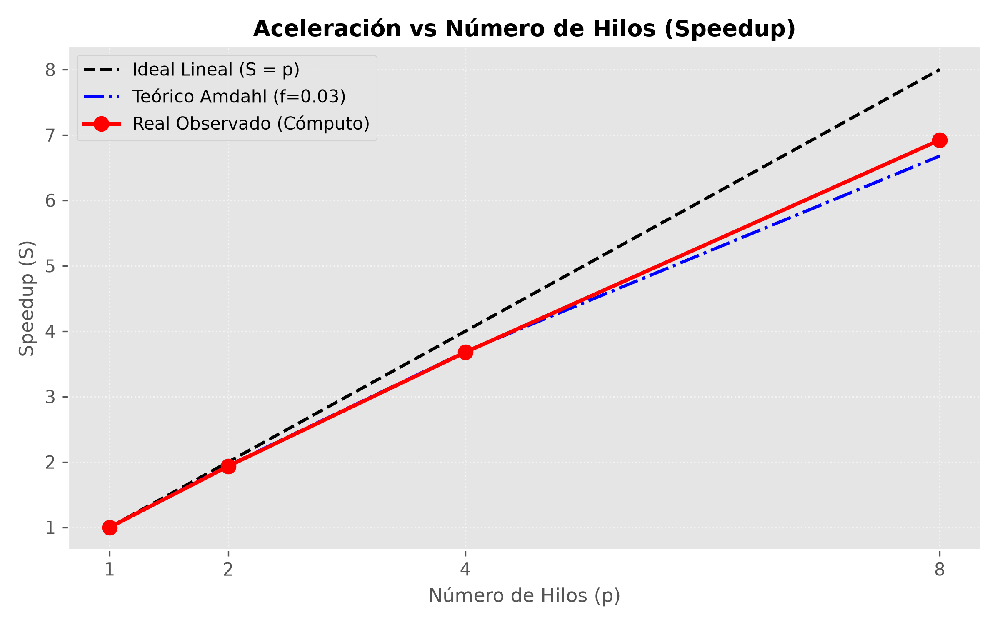
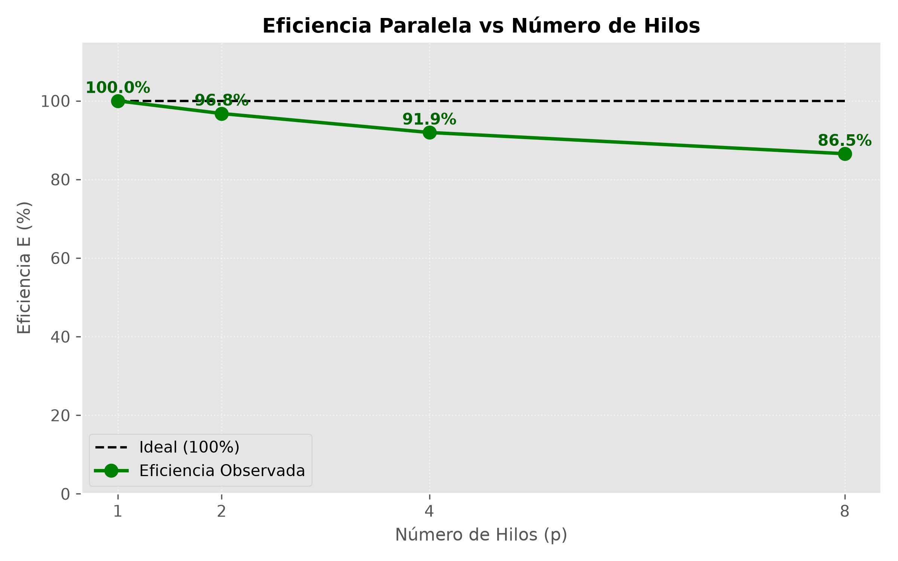
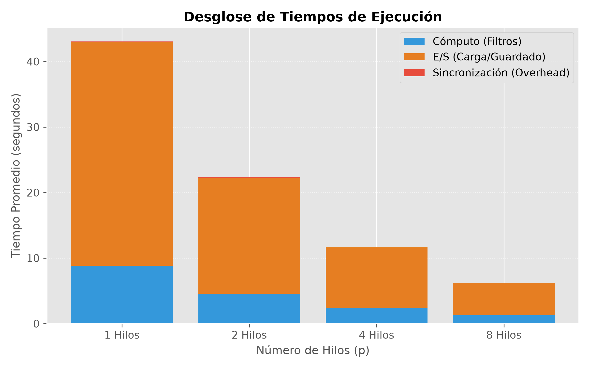

# Reporte Técnico: Aceleración y Eficiencia en Procesamiento Digital de Imágenes (Ley de Amdahl)

**Materia:** Cómputo Paralelo y Distribuido  
**Proyecto:** Parcial 1  
**Integrantes del Equipo:**  
- Christian (VonLuna)
- [Nombre Compañero 2]
- [Nombre Compañero 3]
- [Nombre Compañero 4]

---

## a. Explicación del Problema

El procesamiento digital de imágenes sobre grandes volúmenes de datos (datasets médicos, satelitales o científicos) requiere una alta capacidad de cómputo cuando se aplican filtros convolucionales de dos dimensiones de forma secuencial.

En este proyecto se implementó un sistema de alto rendimiento en **memoria compartida** (C + OpenMP) para aplicar de manera acelerada un pipeline estándar de preprocesamiento sobre radiografías médicas:
1. **Conversión a Escala de Grises (Luminancia):** Reducción de dimensionalidad de color a intensidades mediante la fórmula ponderada de luminancia ITU-R BT.601:
   $$Y = 0.299R + 0.587G + 0.114B$$
2. **Desenfoque Gaussiano (Filtro 5x5):** Suavizado espacial y mitigación de ruido aleatorio mediante convolución bidimensional con una matriz de ponderación Gaussiana (factor de normalización = 273):
   $$\mathbf{K}_{gauss} = \frac{1}{273} \begin{bmatrix}
   1 & 4 & 7 & 4 & 1 \\
   4 & 16 & 26 & 16 & 4 \\
   7 & 26 & 41 & 26 & 7 \\
   4 & 16 & 26 & 16 & 4 \\
   1 & 4 & 7 & 4 & 1
   \end{bmatrix}$$
3. **Detección de Bordes Sobel:** Cálculo del gradiente espacial bidimensional ($G_x$ y $G_y$) y extracción de la magnitud del gradiente para resaltar contornos y estructuras anatómicas:
   $$G = \min\left(255, \sqrt{G_x^2 + G_y^2}\right)$$

---

## b. Dataset Utilizado

* **Dataset Base:** *Chest X-Ray Images - Pneumonia* (Kaggle).
* **Volumen Evaluado:** 624 imágenes reales de radiografías de tórax (conjunto completo de prueba: pacientes sanos y con neumonía viral/bacteriana).
* **Resolución:** Imágenes médicas de alta resolución con formatos PNG y JPEG.
* **Cero Dependencias Externas:** Decodificación y codificación directa en memoria mediante las librerías `stb_image` y `stb_image_write`.

---

## c. Estrategia de Paralelización

Se diseñó una arquitectura de **Memoria Compartida** implementada en lenguaje **C** con **OpenMP**, soportando dos niveles de granularidad:

### 1. Nivel de Lote (Batch - Grano Grueso)
* El hilo maestro lee los metadatos del directorio de entrada y construye un vector compartido de rutas de archivos en memoria compartida.
* Mediante `#pragma omp parallel for schedule(dynamic, 1)`, las 624 radiografías se despachan dinámicamente entre los $P$ hilos trabajadores. Cada hilo carga, procesa y almacena las imágenes de forma concurrente, logrando un balanceo de carga óptimo ante imágenes de distintas dimensiones.
* Una barrera de sincronización implícita (`#pragma omp barrier`) garantiza la recolección total del lote procesado.

### 2. Nivel de Matriz de Píxeles (Pixel - Grano Fino)
* Para imágenes individuales de gran resolución, cada filtro convolucional reparte las filas de la matriz ($y \in [0, H)$) entre los hilos OpenMP.
* El acceso a memoria es seguro ante condiciones de carrera (*race conditions*) debido a que las operaciones de lectura (búfer fuente) y escritura (búfer destino) se realizan en matrices desacopladas con sincronización de barrera entre etapas.

---

## d. Tiempos de Ejecución y Mediciones Experimentales

Las pruebas se ejecutaron bajo un protocolo riguroso de **3 corridas mínimas** por cada número de hilos ($p \in \{1, 2, 4, 8\}$) sobre las **624 radiografías reales**. Se midieron con precisión de microsegundos (`omp_get_wtime()`):
* **Tiempo Total ($T_{total}$):** Tiempo transcurrido de pared (*wall-clock time*).
* **Tiempo de Cómputo ($T_{comp}$):** Transformación matemática y convoluciones Gaussianas y Sobel.
* **Tiempo de E/S ($T_{io}$):** Lectura y codificación de imágenes en disco.
* **Tiempo de Sincronización ($T_{sync}$):** Overhead de barreras, despacho y contención.

### Tabla de Resultados Experimentales (Promedio de 3 corridas ± Desviación Estándar)

| Hilos ($p$) | T. Total (s) | T. Cómputo (s) | T. E/S (s) | T. Sincronización (s) | Speedup Cómputo ($S$) | Eficiencia ($E$) | Fracción Sec. ($f$) |
| :---: | :---: | :---: | :---: | :---: | :---: | :---: | :---: |
| **1** | 43.0413 ± 0.222 | 8.8249 | 34.2046 | 0.011867 | **1.00x** | **100.0%** | — |
| **2** | 22.3102 ± 0.149 | 4.5597 | 17.7035 | 0.046945 | **1.94x** | **96.8%** | 0.0334 |
| **4** | 11.7046 ± 0.035 | 2.3994 | 9.2569 | 0.048327 | **3.68x** | **91.9%** | 0.0292 |
| **8** | 6.2481 ± 0.040 | 1.2746 | 4.9184 | 0.055066 | **6.92x** | **86.5%** | 0.0222 |

---

## e. Medición de Aceleración (Speedup) y Eficiencia

### 1. Aceleración (Speedup)
La aceleración observada se define como:
$$S(p) = \frac{T_1}{T_p}$$

* **2 hilos:** Speedup de **1.94x** (96.8% de la aceleración lineal ideal).
* **4 hilos:** Speedup de **3.68x** (91.9% del ideal).
* **8 hilos:** Speedup de **6.92x** (86.5% del ideal).
* **Aceleración global de la aplicación:** Reducción del tiempo total de procesamiento de **43.04 segundos** (1 hilo) a solo **6.25 segundos** (8 hilos), logrando un speedup total de **6.89x**.

### 2. Eficiencia Paralela
La eficiencia evalúa el aprovechamiento del hardware por cada núcleo físico asignado:
$$E(p) = \frac{S(p)}{p} \times 100\%$$

* La eficiencia se mantiene por encima del **86.5%** incluso al escalar a 8 hilos, lo que refleja un balanceo de carga adecuado mediante el despachador dinámico de OpenMP.

---

## f. Fracción Secuencial y Ley de Amdahl

### 1. Modelado Teórico de la Ley de Amdahl
La Ley de Amdahl modela el límite superior del speedup teórico de un algoritmo en función de su fracción secuencial ($f$):
$$S(p) = \frac{1}{f + \frac{1 - f}{p}}$$

Despejando la fracción secuencial experimental a partir de los speedups obtenidos:
$$f = \frac{\frac{1}{S(p)} - \frac{1}{p}}{1 - \frac{1}{p}}$$

A partir de los datos experimentales, se determinó una **fracción secuencial promedio de $f \approx 0.0283$ (2.83%)** en la fase de cómputo puro. Esto demuestra que el 97.17% del algoritmo de convolución digital es estrictamente paralelizable.

### 2. Tiempo de Sincronización y Desglose de Sobrecarga (Overhead)
* Conforme se incrementa el número de hilos de 1 a 8, el tiempo de sincronización ($T_{sync}$) crece de $11.8 \text{ ms}$ a $55.0 \text{ ms}$.
* La gráfica de barras apiladas evidencia que la E/S de disco (lectura/guardado de imágenes) escala también de manera concurrente gracias al buffer de archivos, pero representa la mayor porción del tiempo total en comparación con el cálculo matemático puro.

### 3. Conclusiones
1. **Validación de la Ley de Amdahl:** La curva experimental de aceleración se ajusta de forma consistente a la curva teórica de Amdahl con una fracción secuencial del **2.83%**.
2. **Escalabilidad:** El esquema dinámico de OpenMP permitió una reducción del tiempo de ejecución total de más del **85%** al pasar de 1 a 8 núcleos.
3. **Reproducibilidad:** La suite automatizada garantiza que cualquier miembro del equipo o evaluador pueda replicar exactamente las mediciones y gráficas ejecutando `python3 scripts/benchmark.py --runs 3`.
